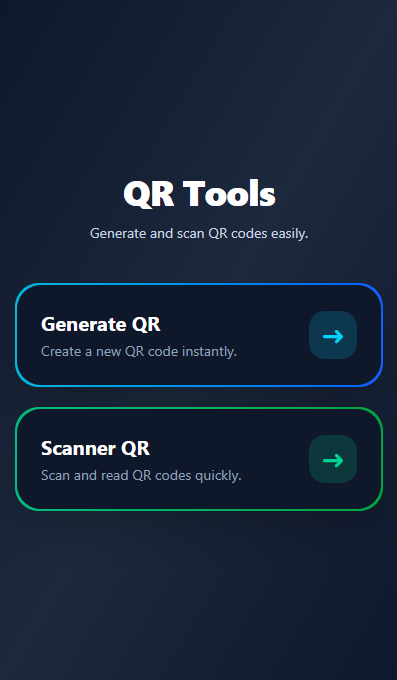
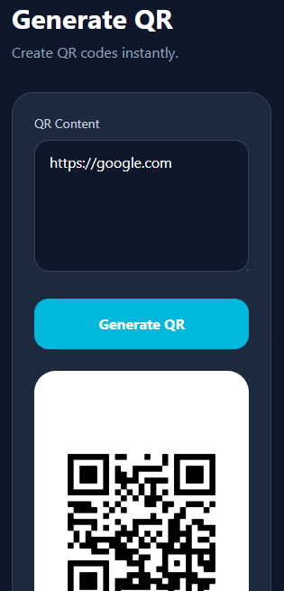
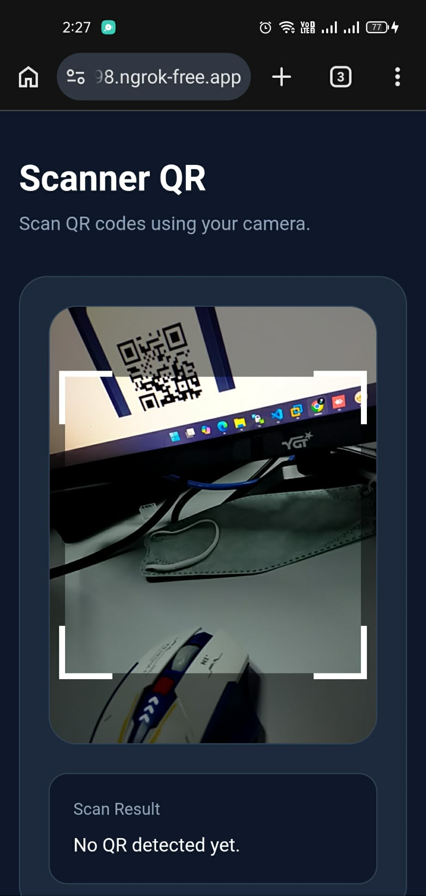

# PHP-PracticalExample-LaravelLivewireQR

- This is a practical example Laravel app that demonstrates generating QR codes and scanning them in the browser using Livewire. The scanner requires HTTPS (or localhost) to allow camera access, so the README includes steps to test via ngrok.

- [**Livewire**](https://livewire.laravel.com/) is the most productive way to build your next web app.

- [**NGROK**](https://ngrok.com/) is an all-in-one cloud networking platform that secures, transforms, and routes your traffic to services running anywhere..

- [**SimpleQRCode**](https://github.com/SimpleSoftwareIO/simple-qrcode) is an easy to use wrapper for the popular Laravel framework based on the great work provided by Bacon/BaconQrCode.

- [**HTML5-QRCODE**](https://www.npmjs.com/package/html5-qrcode) is a lightweight library to easily / quickly integrate QR code, bar code, and other common code scanning capabilities to your web application.

## How to setup and run ngrok

1. Download ngrok and install.

2. Add your auth token.
```
ngrok config add-authtoken "<YOUR_AUTHTOKEN>"
```

3. Start an endpoint.
```
ngrok http 8000
```

## Screenshots

### This is the main page.


### This is the Generate QR livewire page.


### This is the Scanner livewire page.



## Developer

- [Jerome Soriano](https://github.com/dvxgit-jsoriano)

*"Feel free to read, use, and apply to your projects."*